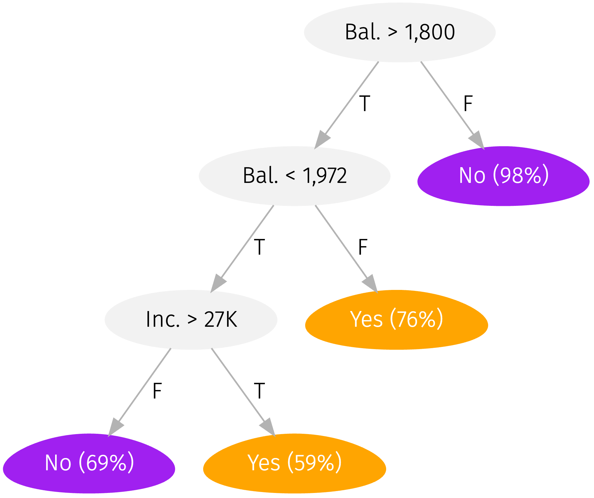
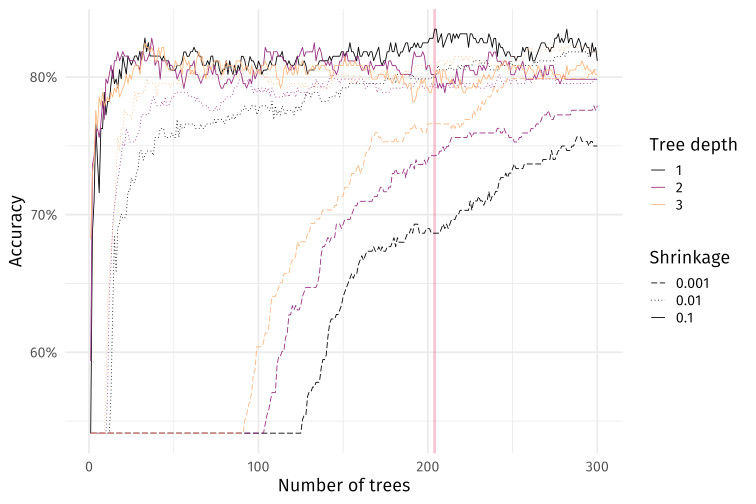
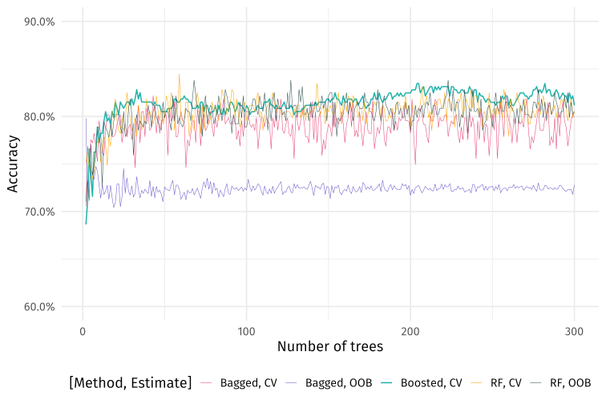

class: inverse, middle

```{r, setup, include = F}
# devtools::install_github("dill/emoGG")
library(pacman)
p_load(
  broom, tidyverse,
  ggplot2, ggthemes, ggforce, ggridges, cowplot, scales,
  latex2exp, viridis, extrafont, gridExtra, plotly, ggformula,
  kableExtra, DT, 
  data.table, dplyr, snakecase, janitor,
  lubridate, knitr, future, furrr, parallel,
  MASS, estimatr, FNN, parsnip, caret, glmnet,
  huxtable, here, magrittr
)
# Define pink color
red_pink <- "#e64173"
turquoise <- "#20B2AA"
orange <- "#FFA500"
red <- "#fb6107"
blue <- "#3b3b9a"
green <- "#8bb174"
grey_light <- "grey70"
grey_mid <- "grey50"
grey_dark <- "grey20"
purple <- "#6A5ACD"
slate <- "#314f4f"
# Dark slate grey: #314f4f
# Knitr options
opts_chunk$set(
  comment = "#>",
  fig.align = "center",
  fig.height = 7,
  fig.width = 10.5,
  warning = F,
  message = F
)
opts_chunk$set(dev = "svg")
options(device = function(file, width, height) {
  svg(tempfile(), width = width, height = height)
})
options(knitr.table.format = "html")
theme_set(theme_gray(base_size = 20))
```

```{css, echo = F, eval = F}
@media print {
  .has-continuation {
    display: block !important;
  }
}
```

$$
\begin{align}
  \def\ci{\perp\mkern-10mu\perp}
\end{align}
$$


# Prologue

---
name: schedule

# Schedule

## Last time

Resampling methods

## Today

A one-lecture introduction to machine-learning methods

## Upcoming

The end is near—as are the last problem set and the final.

---
class: inverse, middle
# Prediction: What's the goal?

---
layout: true
# Prediction: What's the goal?

---
name: different
##  What's different?

Machine-learning methods *typically* focus on .hi-purple[prediction]. What's different?

--

Up to this point, we've focused on causal .hi[identification/inference] of $\beta$, _i.e._,

$$\color{#6A5ACD}{\text{Y}_{i}} = \text{X}_{i} \color{#e64173}{\beta} + u_i$$

meaning we want an unbiased (consistent) and precise estimate $\color{#e64173}{\hat\beta}$.

--

With .hi-purple[prediction], we shift our focus to accurately estimating outcomes.

In other words, how can we best construct $\color{#6A5ACD}{\hat{\text{Y}}_{i}}$?

---
## ... so?

So we want "nice"-performing estimates $\hat y$ instead of $\hat\beta$.

.qa[Q] Can't we just use the same methods (_i.e._, OLS)?

--

.qa[A] It depends.
--
 How well does your .hi[linear]-regression model approximate the underlying data? (And how do you plan to select your model?)

--

.note[Recall] Least-squares regression is a great .hi[linear] estimator and predictor.

---
layout: false
class: clear, middle

Data data be tricky.super[.pink[†]]—as can understanding many relationships.

.footnote[
.pink[†] "Tricky" might mean nonlinear... or many other things...
]


---
layout: true
class: clear
---
exclude: true

```{r, data prediction types, include = F, cache = T}
# Generate data
n = 1e3
set.seed(123)
tmp_df = tibble(
  x = runif(n = n, min = -10, max = 10),
  er = rnorm(n = n, sd = 70),
  y = 0.3* x^2 + sqrt(abs(er)) - 17
) %>% mutate(y = ifelse(y > 0, y, 5 - x + 0.03 * er)) %>% mutate(y = abs(y)^0.7)
# Estimate
knn_df = tibble(
  x = seq(-10, 10, by = 0.1),
  y = knn.reg(
    train = tmp_df[,"x"] %>% as.matrix(),
    test = tibble(x = seq(-10, 10, by = 0.1)),
    y = tmp_df[,"y"] %>% as.matrix(),
    k = 100
  )$pred
)
knn_c_df = tibble(
  x = seq(-10, 10, by = 0.1),
  y = knn.reg(
    train = tmp_df[,"x"] %>% as.matrix(),
    test = tibble(x = seq(-10, 10, by = 0.1)),
    y = tmp_df[,"y"] %>% as.matrix(),
    k = 10
  )$pred
)
# Random forest
rf_model = rand_forest(mode = "regression", mtry = 1, trees = 10000) %>%
  set_engine("ranger", seed = 12345, num.threads = 10) %>%
  fit_xy(y = tmp_df[,"y"], x = tmp_df[,"x"])
# Predict onto testing data
rf_df = tibble(
  y = predict(rf_model, new_data = tibble(x = seq(-10, 10, by = 0.1)))$.pred,
  x = seq(-10, 10, by = 0.1)
)
# The plot
gg_basic =
ggplot(data = tmp_df, aes(x, y)) +
geom_hline(yintercept = 0) +
geom_vline(xintercept = 0) +
geom_point(size = 3.5, shape = 19, alpha = 0.05) +
geom_point(size = 3.5, shape = 1, alpha = 0.2) +
theme_void(base_family = "Fira Sans Book") +
xlab("Y") + ylab("X") +
theme(
  axis.title.y.left = element_text(size = 18, hjust = 1, vjust = 0),
  axis.title.x.bottom = element_text(size = 18, hjust = 0.5, vjust = 0.5, angle = 0)
)
```

---
name: graph-example

.white[blah]
```{r, plot points, echo = F}
gg_basic
```

---
.pink[Linear regression]
```{r, plot ols, echo = F}
gg_basic +
geom_smooth(method = "lm", se = F, color = red_pink, size = 1.25)
```

---
.pink[Linear regression], .turquoise[linear regression] $\color{#20B2AA}{\left( x^4 \right)}$
```{r, plot ols poly, echo = F}
gg_basic +
geom_smooth(method = "lm", se = F, color = red_pink, size = 1.25) +
geom_smooth(method = "lm", formula = y ~ poly(x, 4), se = F, color = turquoise, size = 1.25)
```

---
.pink[Linear regression], .turquoise[linear regression] $\color{#20B2AA}{\left( x^4 \right)}$, .purple[KNN (100)]
```{r, plot knn, echo = F}
gg_basic +
geom_smooth(method = "lm", se = F, color = red_pink, size = 1.25) +
geom_smooth(method = "lm", formula = y ~ poly(x, 4), se = F, color = turquoise, size = 1.25) +
geom_path(data = knn_df, color = purple, size = 1.25)
```

---
.pink[Linear regression], .turquoise[linear regression] $\color{#20B2AA}{\left( x^4 \right)}$, .purple[KNN (100)], .orange[KNN (10)]
```{r, plot knn more, echo = F}
gg_basic +
geom_smooth(method = "lm", se = F, color = red_pink, size = 1.25) +
geom_smooth(method = "lm", formula = y ~ poly(x, 4), se = F, color = turquoise, size = 1.25) +
geom_path(data = knn_df, color = purple, size = 1.25) +
geom_path(data = knn_c_df, color = orange, size = 1.25)
```

---
.pink[Linear regression], .turquoise[linear regression] $\color{#20B2AA}{\left( x^4 \right)}$, .purple[KNN (100)], .orange[KNN (10)], .slate[random forest]
```{r, plot rf, echo = F}
gg_basic +
geom_smooth(method = "lm", se = F, color = red_pink, size = 1.25) +
geom_smooth(method = "lm", formula = y ~ poly(x, 4), se = F, color = turquoise, size = 1.25) +
geom_path(data = knn_df, color = purple, size = 1.25) +
geom_path(data = knn_c_df, color = orange, size = 1.25) +
geom_path(data = rf_df, color = slate, size = 1.25)
```

---
class: clear, middle

.note[Note] That example only had one predictor...

---
layout: false
name: tradeoffs
# What's the goal?
## Tradeoffs

In prediction, we constantly face many tradeoffs, _e.g._,
- .hi[flexibility] and .hi-slate[parametric structure] (and interpretability)
- performance in .hi[training] and .hi-slate[test] samples
- .hi[variance] and .hi-slate[bias]

--

As your economic training should have predicted, in each setting, we need to .b[balance the additional benefits and costs] of adjusting these tradeoffs.

--

Many machine-learning (ML) techniques/algorithms are crafted to optimize with these tradeoffs, but the practitioner (you) still needs to be careful.

---
name: more-goals
# What's the goal?

There are many  reasons to step outside the world of linear regression...

--

.hi-slate[Multi-class] classification problems
- Rather than {0,1}, we need to classify $y_i$ into 1 of K classes
- _E.g._, ER patients: {heart attack, drug overdose, stroke, nothing}

--

.hi-slate[Text analysis] and .hi-slate[image recognition]
- Comb though sentences (pixels) to glean insights from relationships
- _E.g._, detect sentiments in tweets or roof-top solar in satellite imagery

--

.hi-slate[Unsupervised learning]
- You don't know groupings, but you think there are relevant groups
- _E.g._, classify spatial data into groups
---
layout: true
class: clear, middle

---
name: example-articles
```{r, xray image, echo = F, out.width = '90%'}
knitr::include_graphics("images/ml-xray.png")
```

---
```{r, cars image, echo = F, out.width = '90%'}

```

---
```{r, ny image, echo = F, out.width = '90%'}

```

---
```{r, gender-race image, echo = F, out.width = '90%'}
knitr::include_graphics("images/ml-issues.jpeg")
```

---
layout: false
class: clear, middle

Flexibility is huge, but we still want to avoid overfitting.

---
layout: true
# Statistical learning

---
name: sl-classes
## What is it good for?

--

A lot of things.
--
 We tend to break statistical-learning into two(-ish) classes:

1. .hi-slate[Supervised learning] builds ("learns") a statistical model for predicting an .hi-orange[output] $\left( \color{#FFA500}{\mathbf{y}} \right)$ given a set of .hi-purple[inputs] $\left( \color{#6A5ACD}{\mathbf{x}_{1},\, \ldots,\, \mathbf{x}_{p}} \right)$,
--
 _i.e._, we want to build a model/function $\color{#20B2AA}{f}$
$$\color{#FFA500}{\mathbf{y}} = \color{#20B2AA}{f}\!\left( \color{#6A5ACD}{\mathbf{x}_{1},\, \ldots,\, \mathbf{x}_{p}} \right)$$
that accurately describes $\color{#FFA500}{\mathbf{y}}$ given some values of $\color{#6A5ACD}{\mathbf{x}_{1},\, \ldots,\, x_{p}}$.

--

2. .hi-slate[Unsupervised learning] learns relationships and structure using only .hi-purple[inputs] $\left( \color{#6A5ACD}{x_{1},\, \ldots,\, x_{p}} \right)$ without any *supervising* output
--
—letting the data "speak for itself."

---
layout: false
class: clear, middle

.hi-slate[Semi-supervised learning] falls somewhere between these supervised and unsupervised learning—generally applied to supervised tasks when labeled .hi-orange[outputs] are incomplete.

---
class: clear, middle

```{r, comic, echo = F}

```

.it[.smaller[[Source](https://twitter.com/athena_schools/status/1063013435779223553)]]

---
layout: true
# Statistical learning

---
## Output

We tend to further break .hi-slate[supervised learning] into two groups, based upon the .hi-orange[output] (the .orange[outcome] we want to predict):

--

1. .hi-slate[Classification tasks] for which the values of $\color{#FFA500}{\mathbf{y}}$ are discrete categories
<br>*E.g.*, race, sex, loan default, hazard, disease, flight status

2. .hi-slate[Regression tasks] in which $\color{#FFA500}{\mathbf{y}}$ takes on continuous, numeric values.
<br>*E.g.*, price, arrival time, number of emails, temperature

.note[Note.sub[1]] The use of .it[regression] differs from our use of .it[linear regression].

--

.note[Note.sub[2]] Don't get tricked: Not all numbers represent continuous, numerical values—_e.g._, zip codes, industry codes, social security numbers..super[.pink[†]]

.footnote[
.pink[†] .qa[Q] Where would you put responses to 5-item Likert scales?
]

---
name: sl-goal
## The goal

As defined before, we want to *learn* a model to understand our data.

--

1. Take our (numeric) .orange[output] $\color{#FFA500}{\mathbf{y}}$.
2. Imagine there is a .turquoise[function] $\color{#20B2AA}{f}$ that takes .purple[inputs] $\color{#6A5ACD}{\mathbf{X}} = \color{#6A5ACD}{\mathbf{x}_1}, \ldots, \color{#6A5ACD}{\mathbf{x}_p}$ <br>and maps them, plus a random, mean-zero .pink[error term] $\color{#e64173}{\varepsilon}$, to the .orange[output].
$$\color{#FFA500}{\mathbf{y}} = \color{#20B2AA}{f} \! \left( \color{#6A5ACD}{\mathbf{X}} \right) + \color{#e64173}{\varepsilon}$$

---

## Learning from $\hat{f}$

There are two main reasons we want to learn about $\color{#20B2AA}{f}$

1. .hi-slate[*Causal* inference settings] How do changes in $\color{#6A5ACD}{\mathbf{X}}$ affect $\color{#FFA500}{\mathbf{y}}$?
<br> .grey-light[What we've done all quarter.]

--

1. .hi-slate[Prediction problems] Predict $\color{#FFA500}{\mathbf{y}}$ using our estimated $\color{#20B2AA}{f}$, _i.e._,
$$\hat{\color{#FFA500}{\mathbf{y}}} = \hat{\color{#20B2AA}{f}}\!(\color{#6A5ACD}{\mathbf{X}})$$
our *black-box setting* where we care less about $\color{#20B2AA}{f}$ than $\hat{\color{#FFA500}{\mathbf{y}}}$..super[.pink[†]]

.footnote[
.pink[†] You shouldn't actually treat your prediction methods as total black boxes.
]

--

Similarly, in causal-inference settings, we don't particulary care about $\hat{\color{#FFA500}{\mathbf{y}}}$.

---

name: sl-prediction
## Prediction errors

As tends to be the case in life, you will make errors in predicting $\color{#FFA500}{\mathbf{y}}$.

The accuracy of $\hat{\color{#FFA500}{\mathbf{y}}}$ depends upon .hi-slate[two errors]:

--

1. .hi-slate[Reducible error] The error due to $\hat{\color{#20B2AA}{f}}$ imperfectly estimating $\color{#20B2AA}{f}$.
<br>*Reducible* in the sense that we could improve $\hat{\color{#20B2AA}{f}}$.

--

1. .hi-slate[Irreducible error] The error component that is outside of the model $\color{#20B2AA}{f}$.
<br>*Irreducible* because we defined an error term $\color{#e64173}{\varepsilon}$ unexplained by $\color{#20B2AA}{f}$.

--

.note[Note] As its name implies, you can't get rid of .it[irreducible] error—but we can try to get rid of .it[reducible] errors.

---
## Prediction errors

Why we're stuck with .it[irreducible] error

$$
\begin{aligned}
  \mathop{E}\left[ \left\{ \color{#FFA500}{\mathbf{y}} - \hat{\color{#FFA500}{\mathbf{y}}} \right\}^2 \right]
  &=
  \mathop{E}\left[ \left\{ \color{#20B2AA}{f}(\color{#6A5ACD}{\mathbf{X}}) + \color{#e64173}{\varepsilon} + \hat{\color{#20B2AA}{f}}(\color{#6A5ACD}{\mathbf{X}}) \right\}^2 \right] \\
  &= \underbrace{\left[ \color{#20B2AA}{f}(\color{#6A5ACD}{\mathbf{X}}) - \hat{\color{#20B2AA}{f}}(\color{#6A5ACD}{\mathbf{X}}) \right]^2}_{\text{Reducible}} + \underbrace{\mathop{\text{Var}} \left( \color{#e64173}{\varepsilon} \right)}_{\text{Irreducible}}
\end{aligned}
$$

In less math:

- If $\color{#e64173}{\varepsilon}$ exists, then $\color{#6A5ACD}{\mathbf{X}}$ cannot perfectly explain $\color{#FFA500}{\mathbf{y}}$.
- So even if $\hat{\color{#20B2AA}{f}} = \color{#20B2AA}{f}$, we still have irreducible error.

--

Thus, to form our .hi-slate[best predictors], we will .hi-slate[minimize reducible error].

---
layout: true
# Model accuracy

---
name: mse
## MSE

.attn[Mean squared error (MSE)] is the most common.super[.pink[†]] way to measure model performance in a regression setting.

.footnote[
.pink[†] *Most common* does not mean best—it just means lots of people use it.
]

$$\text{MSE} = \dfrac{1}{n} \sum_{i=1}^n \left[ \color{#FFA500}{y}_i - \hat{\color{#20B2AA}{f}}(\color{#6A5ACD}{x}_i) \right]^2$$

.note[Recall:]  $\color{#FFA500}{y}_i - \hat{\color{#20B2AA}{f}}(\color{#6A5ACD}{x}_i) = \color{#FFA500}{y}_i - \hat{\color{#FFA500}{y}}_i$ is our prediction error.

--

Two notes about MSE

1. MSE will be (relatively) very small when .hi-slate[prediction error] is nearly zero.
1. MSE .hi-slate[penalizes] big errors more than little errors (the squared part).
---
name: training-testing

## Training or testing?

Low MSE (accurate performance) on the data that trained the model isn't actually impressive—maybe the model is just overfitting our data..super[.pink[†]]

.footnote[
.pink[†] Recall the kNN performance for k=1.
]

.note[What we want:] How well does the model perform .hi-slate[on data it has never seen]?

--

This introduces an important distinction:

1. .hi-slate[Training data]: The observations $(\color{#FFA500}{y}_i,\color{#e64173}{x}_i)$ used to .hi-slate[train] our model $\hat{\color{#20B2AA}{f}}$.
1. .hi-slate[Testing data]: The observations $(\color{#FFA500}{y}_0,\color{#e64173}{x}_0)$ that our model has yet to see—and which we can use to evaluate the performance of $\hat{\color{#20B2AA}{f}}$.

--

.hi-slate[Real goal: Low test-sample MSE] (not the training MSE from before).

---
## Regression and loss

For .b[regression settings], the loss is our .pink[prediction]'s distance from .orange[truth], _i.e._,
$$
\begin{align}
  \text{error}_i = \color{#FFA500}{y_i} - \color{#e64173}{\hat{y}_i} && \text{loss}_i = \big| \color{#FFA500}{y_i} - \color{#e64173}{\hat{y}_i} \big| = \big| \text{error}_i \big|
\end{align}
$$
Depending upon our ultimate goal, we choose .b[loss/objective functions].
$$
\begin{align}
  \text{L1 loss} = \sum_i \big| \color{#FFA500}{y_i} - \color{#e64173}{\hat{y}_i} \big| &&&& \text{MAE} = \dfrac{1}{n}\sum_i \big| \color{#FFA500}{y_i} - \color{#e64173}{\hat{y}_i} \big| \\
  \text{L2 loss} = \sum_i \left( \color{#FFA500}{y_i} - \color{#e64173}{\hat{y}_i} \right)^2 &&&& \text{MSE} = \dfrac{1}{n}\sum_i \left( \color{#FFA500}{y_i} - \color{#e64173}{\hat{y}_i} \right)^2 \\
\end{align}
$$
Whatever we're using, we care about .hi[test performance] (_e.g._, test MSE), rather than training performance.
---
## Classification

For .b[classification problems], we often use the .hi[test error rate].
$$
\begin{align}
  \dfrac{1}{n} \sum_{i=1}^{n} \mathop{\mathbb{I}}\left( \color{#FFA500}{y_i} \neq \color{#e64173}{\hat{y}_i} \right)
\end{align}
$$
The .b[Bayes classifier]

1. predicts class $\color{#e64173}{j}$ when $\mathop{\text{Pr}}\left(\color{#FFA500}{y_0} = \color{#e64173}{j} \big | \color{#6A5ACD}{\mathbf{X}} = \mathbf{x}_0 \right)$ exceeds all other classes.

2. produces the .b[Bayes decision boundary]—the decision boundary with the lowest test error rate.

3. is unknown: we must predict $\mathop{\text{Pr}}\left(\color{#FFA500}{y_0} = \color{#e64173}{j} \big | \color{#6A5ACD}{\mathbf{X}} = \mathbf{x}_0 \right)$.

---
layout: true
# Flexibility

---

name: bias-variance
## The bias-variance tradeoff

Finding the optimal level of flexibility highlights the .hi-pink[bias]-.hi-purple[variance] .b[tradeoff].

.hi-pink[Bias] The error that comes from inaccurately estimating $\color{#20B2AA}{f}$.
- More flexible models are better equipped to recover complex relationships $\left( \color{#20B2AA}{f} \right)$, reducing bias. (Real life is seldom linear.)
- Simpler (less flexible) models typically increase bias.

.hi-purple[Variance] The amount $\hat{\color{#20B2AA}{f}}$ would change with a different .hi-slate[training sample]
- If new .hi-slate[training sets] drastically change $\hat{\color{#20B2AA}{f}}$, then we have a lot of uncertainty about $\color{#20B2AA}{f}$ (and, in general, $\hat{\color{#20B2AA}{f}} \not\approx \color{#20B2AA}{f}$).
- More flexible models generally add variance to $\color{#20B2AA}{f}$.

---
## The bias-variance tradeoff

The expected value.super[.pink[†]] of the .hi-pink[test MSE] can be written
$$
\begin{align}
  \mathop{E}\left[ \left(\color{#FFA500}{\mathbf{y_0}} - \mathop{\hat{\color{#20B2AA}{f}}}\left(\color{#6A5ACD}{\mathbf{X}_0}\right) \right)^2 \right] =
  \underbrace{\mathop{\text{Var}} \left( \mathop{\hat{\color{#20B2AA}{f}}}\left(\color{#6A5ACD}{\mathbf{X}_0}\right) \right)}_{\text{Variance}} +
  \underbrace{\left[ \text{Bias}\left( \mathop{\hat{\color{#20B2AA}{f}}}\left(\color{#6A5ACD}{\mathbf{X}_0}\right) \right) \right]^2}_{\text{Bias}} +
  \underbrace{\mathop{\text{Var}} \left( \varepsilon \right)}_{\text{Irr. error}}
\end{align}
$$

.b[The tradeoff] in terms of model flexibility

- Increasing flexibility .it[from total inflexibility] generally .b[reduces bias more] than it increases variance (reducing test MSE).

- At some point, the marginal benefits of flexibility .b[equal] marginal costs.

- Past this point (optimal flexibility), we .b[increase variance more] than we reduce bias (increasing test MSE).

---
layout: false
class: clear, middle

.hi[U-shaped test MSE] with respect to model flexibility (KNN here).
<br>Increases in variance eventually overcome reductions in (squared) bias.

```{r, review-bias-variance, echo = F, fig.height = 6}
# Load data (from lecture 002)
flex_df = here("other-files", "flex-sim.rds") %>% readRDS()
# Find minima
min_train = flex_df %>% filter(mse_type == "train") %>% filter(mse_value == min(mse_value))
min_test = flex_df %>% filter(mse_type == "test") %>% filter(mse_value == min(mse_value))
# Plot
ggplot(data = flex_df, aes(x = 1.5 - s, y = mse_value, color = mse_type)) +
geom_segment(
  data = bind_rows(min_train, min_test),
  aes(x = 1.5 - s, xend = 1.5 - s, y = 0, yend = mse_value),
  color = "grey80",
  size = 0.3,
  linetype = "longdash"
) +
geom_hline(yintercept = 0) +
geom_vline(xintercept = 0) +
geom_line(size = 1.2) +
geom_point(data = bind_rows(min_train, min_test), size = 3.5) +
xlab("Model flexibility") +
ylab("MSE") +
scale_color_viridis_d(
  "", labels = c("Test MSE", "Train MSE"),
  option = "magma", begin = 0.2, end = 0.9
) +
theme_void(base_family = "Fira Sans Book") +
theme(
  legend.position = c(0.9, 0.65),
  axis.title = element_text(size = 20, vjust = 1),
  axis.title.y = element_text(angle = 90),
  legend.text = element_text(size = 18)
)
```
---
layout: false

# Resampling refresher

.hi[Resampling methods] help understand uncertainty in statistical modeling.

The process behind the magic of resampling methods:
1. .b[Repeatedly draw samples] from the .b[training data].
1. .b[Fit your model](s) on each random sample.
1. .b[Compare] model performance (or estimates) .b[across samples].
1. Infer the .b[variability/uncertainty in your model] from (3).

Sounds familiar, right?

---
name: resampling-holdout
# Resampling 
## Hold out

.note[Recall:] We want to find the model that .b[minimizes out-of-sample test error].

If we have a large test dataset, we can use it (once).

.qa[Q.sub[1]] What if we don't have a test set?
<br>
.qa[Q.sub[2]] What if we need to select and train a model?
<br>
.qa[Q.sub[3]] How can we avoid overfitting our training.super[.pink[†]] data during model selection?

.footnote[
.normal[.pink[†]] Also relevant for .it[testing] data.
]

--

.qa[A.sub[1,2,3]] .b[Hold-out methods] (_e.g._, cross validation) use training data to estimate test performance—.b[holding out] a mini "test" sample of the training data that we use to estimate the test error.
---
name: resampling-validation
layout: true
# Hold-out methods
## Option 1: The .it[validation set] approach

To estimate the .hi-pink[test error], we can .it[hold out] a subset of our .hi-purple[training data] and then .hi-slate[validate] (evaluate) our model on this held out .hi-slate[validation set].

- The .hi-slate[validation error rate] estimates the .hi-pink[test error rate]
- The model only "sees" the non-validation subset of the .hi-purple[training data].

---

```{r, data-validation-set, include = F, cache = T}
# Generate data
X = 40
Y = 12
set.seed(12345)
v_df = expand_grid(
  x = 1:X,
  y = 1:Y
) %>% mutate(grp = sample(
  x = c("Train", "Validate"),
  size = X * Y,
  replace = T,
  prob = c(0.7, 0.3)
)) %>% mutate(
  grp2 = c(
    rep("Validate", sum(grp == "Validate")),
    rep("Train", sum(grp == "Train"))
  )
)
```

---

```{r, plot-validation-set, echo = F, dependson = "data-validation-set", fig.height = 3, cache = T}
ggplot(data = v_df, aes(x, y, fill = grp, color = grp)) +
geom_point(shape = 21, size = 4.5, stroke = 0.5, color = purple, fill = "white") +
theme_void() +
theme(legend.position = "none")
```

.col-left[.hi-purple[Initial training set]]


---

```{r, plot-validation-set-2, echo = F, dependson = "data-validation-set", fig.height = 3, cache = T}
ggplot(data = v_df, aes(x, y, fill = grp, color = grp)) +
geom_point(shape = 21, size = 4.5, stroke = 0.5) +
scale_fill_manual("", values = c("white", slate)) +
scale_color_manual("", values = c(purple, slate)) +
theme_void() +
theme(legend.position = "none")
```

.col-left[.hi-slate[Validation (sub)set]]
.col-right[.hi-purple[Training set:] .purple[Model training]]

---

```{r, plot-validation-set-3, echo = F, dependson = "data-validation-set", fig.height = 3, cache = T}
ggplot(data = v_df, aes(x, y, fill = grp2, color = grp2)) +
geom_point(shape = 21, size = 4.5, stroke = 0.5) +
scale_fill_manual("", values = c("white", slate)) +
scale_color_manual("", values = c(purple, slate)) +
theme_void() +
theme(legend.position = "none")
```

.col-left[.hi-slate[Validation (sub)set]]
.col-right[.hi-purple[Training set:] .purple[Model training]]

---
layout: true
# Hold-out methods
## Option 1: The .it[validation set] approach

---
.ex[Example] We could use the validation-set approach to help select the degree of a polynomial for a linear-regression model.

--

The goal of the validation set is to .hi-pink[.it[estimate] out-of-sample (test) error.]

.qa[Q] So what?

--

- Estimates come with .b[uncertainty]—varying from sample to sample.

- Variability (standard errors) is larger with .b[smaller samples].

.qa[Problem] This estimated error is often based upon a fairly small sample (<30% of our training data). So its variance can be large.
---
exclude: true

```{r, sim-validation, include = F, cache = T}
# Generate population and sample
N = 1e5
set.seed(12345)
pop_dt = data.table(
  x1 = runif(N, min = -1, max = 1),
  x2 = runif(N, min = -1, max = 1),
  x3 = runif(N, min = -1, max = 1),
  er = rnorm(N, sd = 3)
)
pop_dt %<>% mutate(
  y = 3 + 5 * x1 - 4 * x2 + 3 * x1 * x2 * x3 + x3 - 2 * x3^2 + 0.1 * x3^3 + er
)
# Grab our sample
sample_dt = pop_dt[1:1e3,]
# For 10 seeds, grab validation set and estimate flexibility
vset_dt = mclapply(
  X = 1:10,
  mc.cores = 8,
  FUN = function(i) {
    # Set seed
    set.seed(i)
    # Grab validation set
    v_i = sample.int(1e3, size = 500, replace = F)
    vset_i = sample_dt[v_i,]
    tset_i = sample_dt[setdiff(1:1e3, v_i),]
    # Train models for y~x3 and grab their validation MSEs
    mse_i = lapply(
      X = 1:10,
      FUN = function(p) {
        # Train the model
        model_ip = lm(y ~ poly(x3, p, raw = T), data = tset_i)
        # Predict
        mean((vset_i$y - predict(model_ip, newdata = vset_i, se.fit = F))^2)
      }
    ) %>% unlist()
    # Create dataset
    data.table(iter = i, degree = 1:10, mse = mse_i)
  }
) %>% rbindlist()
# Repeat using full training model to train and full population to test
mse_true = lapply(
  X = 1:10,
  FUN = function(p) {
    # Train the model
    model_p = lm(y ~ poly(x3, p, raw = T), data = sample_dt)
    # Predict
    mean((pop_dt[-(1:1e3),]$y - predict(model_p, newdata = pop_dt[-(1:1e3),], se.fit = F))^2)
  }
) %>% unlist()
true_dt = data.table(degree = 1:10, mse = mse_true, iter = 1)
```


---
name: validation-simulation
layout: false
class: clear, middle

.b[Validation MSE] for 10 different validation samples
```{r, plot-vset-sim, echo = F, dependson = "sim-validation", cache = T}
ggplot(data = vset_dt, aes(x = degree, y = mse, color = iter, group = iter)) +
geom_line() +
geom_point(shape = 1) +
scale_x_continuous("Polynomial degree of x", breaks = seq(2, 10, 2)) +
ylab("Validation-set MSE") +
theme_minimal(base_size = 18, base_family = "Fira Sans Book") +
scale_color_viridis_c(option = "magma", begin = 0.3, end = 0.9) +
theme(legend.position = "none")
```
---
layout: false
class: clear, middle

.b[True test MSE] compared to validation-set estimates
```{r, plot-vset-sim-2, echo = F, dependson = "sim-validation", cache = T}
ggplot(data = vset_dt, aes(x = degree, y = mse, color = iter, group = iter)) +
geom_line() +
geom_point(shape = 1) +
geom_line(data = true_dt, aes(x = degree, y = mse), color = "black", size = 1) +
geom_point(data = true_dt, aes(x = degree, y = mse), color = "black", size = 3) +
scale_x_continuous("Polynomial degree of x", breaks = seq(2, 10, 2)) +
ylab("MSE") +
theme_minimal(base_size = 18, base_family = "Fira Sans Book") +
scale_color_viridis_c(option = "magma", begin = 0.3, end = 0.9) +
theme(legend.position = "none")
```

---
# Hold-out methods
## Option 1: The .it[validation set] approach

Put differently: The validation-set approach has (≥) two major drawbacks:

1. .hi[High variability] Which observations are included in the validation set can greatly affect the validation MSE.

2. .hi[Inefficiency in training our model] We're essentially throwing away the validation data when training the model—"wasting" observations.

--

(2) ⟹ validation MSE may overestimate test MSE.

Even if the validation-set approach provides an unbiased estimator for test error, it is likely a pretty noisy estimator.
---
layout: true
# Hold-out methods
## Option 2: Leave-one-out cross validation

---
name: resampling-loocv

.hi[Cross validation] solves the validation-set method's main problems.
- Use more (= all) of the data for training (lower variability; less bias).
- Still maintains separation between training and validation subsets.

--

.hi[Leave-one-out cross validation] (LOOCV) is perhaps the cross-validation method most similar to the validation-set approach.
- Your validation set is exactly one observation.
- .note[New] You repeat the validation exercise for every observation.
- .note[New] Estimate MSE as the mean across all observations.

---
layout: true
# Hold-out methods
## Option 2: Leave-one-out cross validation

Each observation takes a turn as the .hi-slate[validation set],
<br>while the other n-1 observations get to .hi-purple[train the model].
<br>
<br>

---
exclude: true

```{r, data-loocv, include = F, cache = T}
# Generate data
X = 40
Y = 12
loocv_df = expand_grid(
  x = 1:X,
  y = -(1:Y)
) %>% mutate(
  i = 1:(X * Y),
  grp_1 = if_else(i == 1, "Validate", "Train"),
  grp_2 = if_else(i == 2, "Validate", "Train"),
  grp_3 = if_else(i == 3, "Validate", "Train"),
  grp_4 = if_else(i == 4, "Validate", "Train"),
  grp_5 = if_else(i == 5, "Validate", "Train"),
  grp_n = if_else(i == X*Y, "Validate", "Train")
)
```

---
```{r, plot-loocv-1, echo = F, fig.height = 3, dependson = "data-loocv", cache = T}
ggplot(data = loocv_df, aes(x, y, fill = grp_1, color = grp_1)) +
geom_point(shape = 21, size = 4.5, stroke = 0.5) +
scale_fill_manual("", values = c("white", slate)) +
scale_color_manual("", values = c(purple, slate)) +
theme_void() +
theme(legend.position = "none")
```

.slate[Observation 1's turn for validation produces MSE.sub[1]].
---
```{r, plot-loocv-2, echo = F, fig.height = 3, dependson = "data-loocv", cache = T}
ggplot(data = loocv_df, aes(x, y, fill = grp_2, color = grp_2)) +
geom_point(shape = 21, size = 4.5, stroke = 0.5) +
scale_fill_manual("", values = c("white", slate)) +
scale_color_manual("", values = c(purple, slate)) +
theme_void() +
theme(legend.position = "none")
```

.slate[Observation 2's turn for validation produces MSE.sub[2]].
---
```{r, plot-loocv-3, echo = F, fig.height = 3, dependson = "data-loocv", cache = T}
ggplot(data = loocv_df, aes(x, y, fill = grp_3, color = grp_3)) +
geom_point(shape = 21, size = 4.5, stroke = 0.5) +
scale_fill_manual("", values = c("white", slate)) +
scale_color_manual("", values = c(purple, slate)) +
theme_void() +
theme(legend.position = "none")
```

.slate[Observation 3's turn for validation produces MSE.sub[3]].
---
```{r, plot-loocv-4, echo = F, fig.height = 3, dependson = "data-loocv", cache = T}
ggplot(data = loocv_df, aes(x, y, fill = grp_4, color = grp_4)) +
geom_point(shape = 21, size = 4.5, stroke = 0.5) +
scale_fill_manual("", values = c("white", slate)) +
scale_color_manual("", values = c(purple, slate)) +
theme_void() +
theme(legend.position = "none")
```

.slate[Observation 4's turn for validation produces MSE.sub[4]].
---
```{r, plot-loocv-5, echo = F, fig.height = 3, dependson = "data-loocv", cache = T}
ggplot(data = loocv_df, aes(x, y, fill = grp_5, color = grp_5)) +
geom_point(shape = 21, size = 4.5, stroke = 0.5) +
scale_fill_manual("", values = c("white", slate)) +
scale_color_manual("", values = c(purple, slate)) +
theme_void() +
theme(legend.position = "none")
```

.slate[Observation 5's turn for validation produces MSE.sub[5]].
---
```{r, plot-loocv-n, echo = F, fig.height = 3, dependson = "data-loocv", cache = T}
# The final observation
ggplot(data = loocv_df, aes(x, y, fill = grp_n, color = grp_n)) +
geom_point(shape = 21, size = 4.5, stroke = 0.5) +
scale_fill_manual("", values = c("white", slate)) +
scale_color_manual("", values = c(purple, slate)) +
theme_void() +
theme(legend.position = "none")
```

.slate[Observation n's turn for validation produces MSE.sub[n]].
---
layout: true
# Hold-out methods
## Option 2: Leave-one-out cross validation

---
Because .hi-pink[LOOCV uses n-1 observations] to train the model,.super[.pink[†]] MSE.sub[i] (validation MSE from observation i) is approximately unbiased for test MSE.

.footnote[
.pink[†] And because often n-1 ≈ n.
]

.qa[Problem] MSE.sub[i] is a terribly noisy estimator for test MSE (albeit ≈unbiased).
--
<br>.qa[Solution] Take the mean!
$$
\begin{align}
  \text{CV}_{(n)} = \dfrac{1}{n} \sum_{i=1}^{n} \text{MSE}_i
\end{align}
$$
--

1. LOOCV .b[reduces bias] by using n-1 (almost all) observations for training.
2. LOOCV .b[resolves variance]: it makes all possible comparison<br>(no dependence upon which validation-test split you make).

---
exclude: true

```{r, mse-loocv, include = F, cache = T, dependson = "sim-validation"}
# Calculate LOOCV MSE for each p
mse_loocv = lapply(
  X = 1:10,
  FUN = function(p) {
    # Train the model
    model_p = lm(y ~ poly(x3, p, raw = T), data = sample_dt)
    # Leverage
    h_p = hatvalues(model_p)
    # y and predictions
    y_p = sample_dt$y
    y_hat_p = model_p$fitted.values
    # MSE
    data.table(
      degree = p,
      mse = 1 / nrow(sample_dt) * sum(((y_p - y_hat_p) / (1 - h_p))^2),
      iter = 1
    )
  }
) %>% rbindlist()
```
---
name: ex-loocv
layout: false
class: clear, middle

.b[True test MSE] and .hi-orange[LOOCV MSE] compared to .hi-purple[validation-set estimates]
```{r, plot-loocv-mse, echo = F, dependson = "mse-loocv", cache = T}
ggplot(data = vset_dt, aes(x = degree, y = mse, group = iter)) +
geom_line(alpha = 0.35, color = purple) +
geom_point(alpha = 0.35, color = purple, shape = 1) +
geom_line(data = true_dt, aes(x = degree, y = mse), color = "black", size = 1) +
geom_point(data = true_dt, aes(x = degree, y = mse), color = "black", size = 3) +
geom_line(data = mse_loocv, aes(x = degree, y = mse), color = orange, size = 1) +
geom_point(data = mse_loocv, aes(x = degree, y = mse), color = orange, size = 3) +
scale_x_continuous("Polynomial degree of x", breaks = seq(2, 10, 2)) +
ylab("MSE") +
theme_minimal(base_size = 18, base_family = "Fira Sans Book") +
scale_color_viridis_c(option = "magma", begin = 0.3, end = 0.9) +
theme(legend.position = "none")
```
---
layout: true
# Hold-out methods
## Option 3: k-fold cross validation

---
name: resampling-kcv

Leave-one-out cross validation is a special case of a broader strategy:
<br>.hi[k-fold cross validation].

1. .b[Divide] the training data into $k$ equally sized groups (folds).
2. .b[Iterate] over the $k$ folds, treating each as a validation set once<br>(training the model on the other $k-1$ folds).
3. .b[Average] the folds' MSEs to estimate test MSE.

--

Benefits?
--

1. .b[Less computationally demanding] (fit model $k=$ 5 or 10 times; not $n$).
--

2. .b[Greater accuracy] (in general) due to bias-variance tradeoff!
--

  - Somewhat higher bias, relative to LOOCV: $n-1$ *vs.* $(k-1)/k$.
--

  - Lower variance due to high-degree of correlation in LOOCV MSE.sub[i].
--
🤯
---
exclude: true

```{r, data-cv, include = F, cache = T}
# Generate data
X = 40
Y = 12
set.seed(12345)
cv_df = expand_grid(
  x = 1:X,
  y = 1:Y
) %>% mutate(
  id = 1:(X*Y),
  grp = sample(X * Y) %% 5 + 1
)
# Find groups
a = seq(1, X*Y, by = X*Y/5)
b = c(a[-1] - 1, X*Y)
```

---
layout: true
# Hold-out methods
## Option 3: k-fold cross validation

With $k$-fold cross validation, we estimate test MSE as
$$
\begin{align}
  \text{CV}_{(k)} = \dfrac{1}{k} \sum_{i=1}^{k} \text{MSE}_{i}
\end{align}
$$
---

```{r, plot-cvk-0a, echo = F, fig.height = 3, dependson = "data-cv"}
ggplot(data = cv_df, aes(x, y, color = grp)) +
geom_point(size = 4.5) +
scale_color_viridis_c(option = "magma", end = 0.925) +
theme_void() +
theme(legend.position = "none")
```

Our $k=$ 5 folds.
---

```{r, plot-cvk-0b, echo = F, fig.height = 3, dependson = "data-cv"}
ggplot(data = cv_df, aes(x, y, color = grp == 1, fill = grp == 1)) +
geom_point(shape = 21, size = 4.5, stroke = 0.5) +
scale_fill_manual("", values = c("white", slate)) +
scale_color_manual("", values = c(purple, slate)) +
theme_void() +
theme(legend.position = "none")
```

Each fold takes a turn at .hi-slate[validation]. The other $k-1$ folds .hi-purple[train].
---

```{r, plot-cvk-1, echo = F, fig.height = 3, dependson = "data-cv"}
ggplot(
  data = cv_df,
  aes(x, y, color = between(id, a[1], b[1]), fill = between(id, a[1], b[1]))
) +
geom_point(shape = 21, size = 4.5, stroke = 0.5) +
scale_fill_manual("", values = c("white", slate)) +
scale_color_manual("", values = c(purple, slate)) +
theme_void() +
theme(legend.position = "none")
```

For $k=5$, fold number $1$ as the .hi-slate[validation set] produces MSE.sub[k=1].
---

```{r, plot-cvk-2, echo = F, fig.height = 3, dependson = "data-cv"}
ggplot(
  data = cv_df,
  aes(x, y, color = between(id, a[2], b[2]), fill = between(id, a[2], b[2]))
) +
geom_point(shape = 21, size = 4.5, stroke = 0.5) +
scale_fill_manual("", values = c("white", slate)) +
scale_color_manual("", values = c(purple, slate)) +
theme_void() +
theme(legend.position = "none")
```

For $k=5$, fold number $2$ as the .hi-slate[validation set] produces MSE.sub[k=2].
---

```{r, plot-cvk-3, echo = F, fig.height = 3, dependson = "data-cv"}
ggplot(
  data = cv_df,
  aes(x, y, color = between(id, a[3], b[3]), fill = between(id, a[3], b[3]))
) +
geom_point(shape = 21, size = 4.5, stroke = 0.5) +
scale_fill_manual("", values = c("white", slate)) +
scale_color_manual("", values = c(purple, slate)) +
theme_void() +
theme(legend.position = "none")
```

For $k=5$, fold number $3$ as the .hi-slate[validation set] produces MSE.sub[k=3].
---

```{r, plot-cvk-4, echo = F, fig.height = 3, dependson = "data-cv"}
ggplot(
  data = cv_df,
  aes(x, y, color = between(id, a[4], b[4]), fill = between(id, a[4], b[4]))
) +
geom_point(shape = 21, size = 4.5, stroke = 0.5) +
scale_fill_manual("", values = c("white", slate)) +
scale_color_manual("", values = c(purple, slate)) +
theme_void() +
theme(legend.position = "none")
```

For $k=5$, fold number $4$ as the .hi-slate[validation set] produces MSE.sub[k=4].
---

```{r, plot-cvk-5, echo = F, fig.height = 3, dependson = "data-cv"}
ggplot(
  data = cv_df,
  aes(x, y, color = between(id, a[5], b[5]), fill = between(id, a[5], b[5]))
) +
geom_point(shape = 21, size = 4.5, stroke = 0.5) +
scale_fill_manual("", values = c("white", slate)) +
scale_color_manual("", values = c(purple, slate)) +
theme_void() +
theme(legend.position = "none")
```

For $k=5$, fold number $5$ as the .hi-slate[validation set] produces MSE.sub[k=5].
---
exclue: true

```{r, sim-cvk, include = F, cache = T, dependson = "sim-validation"}
# 5-fold cross validation, 20 times
cv_sim = mclapply(X = 1:20, mc.cores = 12, FUN = function(s) {
  set.seed(s)
  # Assign folds for CV
  sample_cv = copy(sample_dt) %T>% setDT()
  sample_cv[, fold := sample(1:.N) %% 5 + 1]
  # Iterate over polynomial degrees
  mse_s = lapply(X = 1:10, function(p) {
    # Iterate over folds
    lapply(X = 1:5, FUN = function(k) {
      # Train the model
      model_spk = lm(y ~ poly(x3, p, raw = T), data = sample_cv[fold != k])
      # Predict
      mean(
        (sample_cv[fold == k,y] - predict(
          model_spk,
          newdata = sample_cv[fold == k],
          se.fit = F
        )
      )^2)
    }) %>% unlist() %>% mean()
  }) %>% unlist()
  data.table(degree = 1:10, mse = mse_s, iter = s)
}) %>% rbindlist()
```
---
name: ex-cv-sim
layout: false
class: clear, middle

.b[Test MSE] .it[vs.] estimates: .orange[LOOCV], .pink[5-fold CV] (20x), and .purple[validation set] (10x)
```{r, plot-cv-mse, echo = F, dependson = c("sim-validation", "mse-loocv", "sim-cvk"), cache = T}
ggplot(data = vset_dt, aes(x = degree, y = mse, group = iter)) +
geom_line(alpha = 0.5, color = purple) +
geom_point(alpha = 0.5, color = purple, shape = 1) +
geom_line(data = true_dt, aes(x = degree, y = mse), color = "black", size = 1) +
geom_point(data = true_dt, aes(x = degree, y = mse), color = "black", size = 3) +
geom_line(data = cv_sim, aes(x = degree, y = mse, group = iter), color = red_pink, size = 1) +
geom_point(data = cv_sim, aes(x = degree, y = mse, group = iter), color = red_pink, size = 3) +
geom_line(data = mse_loocv, aes(x = degree, y = mse), color = orange, size = 1) +
geom_point(data = mse_loocv, aes(x = degree, y = mse), color = orange, size = 3) +
scale_x_continuous("Polynomial degree of x", breaks = seq(2, 10, 2)) +
ylab("MSE") +
theme_minimal(base_size = 18, base_family = "Fira Sans Book") +
scale_color_viridis_c(option = "magma", begin = 0.3, end = 0.9) +
theme(legend.position = "none")
```
---
layout: false
class: clear, middle

.note[Note:] Each of these methods extends to classification settings, _e.g._, LOOCV
$$
\begin{align}
   \text{CV}_{(n)} = \dfrac{1}{n} \sum_{i=1}^{n} \mathop{\mathbb{I}}\left( \color{#FFA500}{y_i} \neq \color{#FFA500}{\hat{y}_i} \right)
\end{align}
$$
---
name: holdout-caveats
layout: false
# Hold-out methods
## Caveat

So far, we've treated each observation as separate/independent from each other observation.

The methods that we've defined so far actually need this independence.

---
# Hold-out methods
## Goals and alternatives

You can use CV for either of two important .b[modeling tasks:]

- .hi-purple[Model selection] Choosing and tuning a model

- .hi-purple[Model assessment] Evaluating a model's accuracy

--


.note[Alternative approach:] .attn[Shrinkage methods]
- fit a model that contains .pink[all] $\color{#e64173}{p}$ .pink[predictors]
- simultaneously: .pink[shrink.super[.pink[†]] coefficients] toward zero

.footnote[
.pink[†] Synonyms for .it[shrink]: constrain or regularize
]

--

.note[Idea:] Penalize the model for coefficients as they move away from zero.

---
name: shrinkage-why
# Shrinkage
## Why?

.qa[Q] How could shrinking coefficients twoard zero help or predictions?

--

.qa[A] Remember we're generally facing a tradeoff between bias and variance.

--

- Shrinking our coefficients toward zero .hi[reduces the model's variance]..super[.pink[†]]
- .hi[Penalizing] our model for .hi[larger coefficients] shrinks them toward zero.
- The .hi[optimal penalty] will balance reduced variance with increased bias.

.footnote[
.pink[†] Imagine the extreme case: a model whose coefficients are all zeros has no variance.
]

--

Now you understand shrinkage methods.
- .attn[Ridge regression]
- .attn[Lasso]
- .attn[Elasticnet]

---
layout: true
# Ridge regression

---
class: inverse, middle

---
name: ridge
## Back to least squares (again)

.note[Remember OLS?] Least-squares regression finds $\hat{\beta}_j$'s by minimizing RSS
$$
\begin{align}
  \min_{\hat{\beta}} \text{RSS} = \min_{\hat{\beta}} \sum_{i=1}^{n} e_i^2 = \min_{\hat{\beta}} \sum_{i=1}^{n} \bigg( \color{#FFA500}{y_i} - \color{#6A5ACD}{\underbrace{\left[ \hat{\beta}_0 + \hat{\beta}_1 x_{i,1} + \cdots + \hat{\beta}_p x_{i,p} \right]}_{=\hat{y}_i}} \bigg)^2
\end{align}
$$

--

.attn[Ridge regression] makes a small change
- .pink[adds a shrinkage penalty] = the sum of squared coefficents $\left( \color{#e64173}{\lambda\sum_{j}\beta_j^2} \right)$
- .pink[minimizes] the (weighted) sum of .pink[RSS and the shrinkage penalty]

--

$$
\begin{align}
  \min_{\hat{\beta}^R} \sum_{i=1}^{n} \bigg( \color{#FFA500}{y_i} - \color{#6A5ACD}{\hat{y}_i} \bigg)^2 + \color{#e64173}{\lambda \sum_{j=1}^{p} \beta_j^2}
\end{align}
$$

---
name: ridge-penalization

.col-left[
.hi[Ridge regression]
$$
\begin{align}
\min_{\hat{\beta}^R} \sum_{i=1}^{n} \bigg( \color{#FFA500}{y_i} - \color{#6A5ACD}{\hat{y}_i} \bigg)^2 + \color{#e64173}{\lambda \sum_{j=1}^{p} \beta_j^2}
\end{align}
$$
]

.col-right[
.b[Least squares]
$$
\begin{align}
\min_{\hat{\beta}} \sum_{i=1}^{n} \bigg( \color{#FFA500}{y_i} - \color{#6A5ACD}{\hat{y}_i} \bigg)^2
\end{align}
$$
]

<br><br><br><br>

$\color{#e64173}{\lambda}\enspace (\geq0)$ is a tuning parameter for the harshness of the penalty.
<br>
$\color{#e64173}{\lambda} = 0$ implies no penalty: we are back to least squares.
--
<br>
Each value of $\color{#e64173}{\lambda}$ produces a new set of coefficents.

--

Ridge's approach to the bias-variance tradeoff: .b[Balance]
- reducing .b[RSS], _i.e._, $\sum_i\left( \color{#FFA500}{y_i} - \color{#6A5ACD}{\hat{y}_i} \right)^2$
- reducing .b[coefficients' magnitudes] .grey-light[(ignoring the intercept)]

$\color{#e64173}{\lambda}$ determines how much ridge "cares about" these two quantities..super[.pink[†]]

.footnote[
.pink[†] With $\lambda=0$, least-squares regression only "cares about" RSS.
]

---
## $\lambda$ and penalization

Choosing a .it[good] value for $\lambda$ is key.
- If $\lambda$ is too small, then our model is essentially back to OLS.
- If $\lambda$ is too large, then we shrink all of our coefficients too close to zero.

--

.qa[Q] So what do we do?
--
<br>
.qa[A] Cross validate!

.grey-light[(You saw that coming, right?)]

---
## Penalization and standardization

.attn[Important] Predictors' .hi[units] can drastically .hi[affect ridge regression results].

.b[Why?]
--
 Because $\mathbf{x}_j$'s units affect $\beta_j$, and ridge is very sensitive to $\beta_j$.

--

.ex[Example] Let $x_1$ denote distance.

.b[Least-squares regression]
<br>
If $x_1$ is .it[meters] and $\beta_1 = 3$, then when $x_1$ is .it[km], $\beta_1 = 3,000$.
<br>
The scale/units of predictors do not affect least squares' estimates.

--

.hi[Ridge regression] pays a much larger penalty for $\beta_1=3,000$ than $\beta_1=3$.
<br>You will not get the same (scaled) estimates when you change units.


--

.note[Solution] Standardize your variables, _i.e._, `x_stnd = (x - mean(x))/sd(x)`.

---
layout: true
# Lasso

---
class: inverse, middle
---
name: lasso
## Intro

.attn[Lasso] simply replaces ridge's .it[squared] coefficients with absolute values.

--

.hi[Ridge regression]
$$
\begin{align}
\min_{\hat{\beta}^R} \sum_{i=1}^{n} \big( \color{#FFA500}{y_i} - \color{#6A5ACD}{\hat{y}_i} \big)^2 + \color{#e64173}{\lambda \sum_{j=1}^{p} \beta_j^2}
\end{align}
$$

.hi-grey[Lasso]
$$
\begin{align}
\min_{\hat{\beta}^L} \sum_{i=1}^{n} \big( \color{#FFA500}{y_i} - \color{#6A5ACD}{\hat{y}_i} \big)^2 + \color{#B3B3B3}{\lambda \sum_{j=1}^{p} \big|\beta_j\big|}
\end{align}
$$

Everything else will be the same—except one aspect...

---
name: lasso-shrinkage
## Shrinkage

Unlike ridge, lasso's penalty does not increase with the size of $\beta_j$.

You always pay $\color{#B3B3B3}{\lambda}$ to increase $\big|\beta_j\big|$ by one unit.

--

The only way to avoid lasso's penalty is to .hi[set coefficents to zero].

--

This feature has two .hi-slate[benefits]
1. Some coefficients will be .hi[set to zero]—we get "sparse" models.
1. Lasso can be used for subset/feature .hi[selection].

--

We will still need to carefully select $\color{#B3B3B3}{\lambda}$.
---
exclude: true

```{r, credit-data-work, include = F, cache = T}
# The Credit dataset
credit_dt = ISLR::Credit %>% clean_names() %T>% setDT()
# Clean variables
credit_dt[, `:=`(
  i_female = 1 * (gender == "Female"),
  i_student = 1 * (student == "Yes"),
  i_married = 1 * (married == "Yes"),
  i_asian_american = 1 * (ethnicity == "Asian"),
  i_african_american = 1 * (ethnicity == "African American")
)]
# Drop unwanted variables
credit_dt[, `:=`(id = NULL, gender = NULL, student = NULL, married = NULL, ethnicity = NULL)]
```

```{r, credit-data-preprocess, cache = T}
# Standardize all variables except 'balan ce'
credit_stnd = preProcess(
  # Do not process the outcome 'balance'
  x = credit_dt %>% dplyr::select(-balance),
  # Standardizing means 'center' and 'scale'
  method = c("center", "scale")
)
# We have to pass the 'preProcess' object to 'predict' to get new data
credit_stnd %<>% predict(newdata = credit_dt)
```

```{r, setup-ridge, include = F}
# Define our range of lambdas (glmnet wants decreasing range)
lambdas = 10^seq(from = 5, to = -2, length = 100)
# Fit ridge regression
est_ridge = glmnet(
  x = credit_stnd %>% dplyr::select(-balance) %>% as.matrix(),
  y = credit_stnd$balance,
  standardize = T,
  alpha = 0,
  lambda = lambdas
)
```

```{r, cv-lasso, cache = T}
# Define our lambdas
lambdas = 10^seq(from = 5, to = -2, length = 100)
# Cross validation
lasso_cv = cv.glmnet(
  x = credit_stnd %>% dplyr::select(-balance) %>% as.matrix(),
  y = credit_stnd$balance,
  alpha = 1,
  standardize = T,
  lambda = lambdas,
  # New: How we make decisions and number of folds
  type.measure = "mse",
  nfolds = 5
)
```

---
layout: false
class: clear, middle

.b[Ridge regression coefficents] for $\lambda$ between 0.01 and 100,000
```{r, plot-ridge-glmnet-2, echo = F}
ridge_df = est_ridge %>% coef() %>% t() %>% as.matrix() %>% as.data.frame()
ridge_df %<>% dplyr::select(-1) %>% mutate(lambda = est_ridge$lambda)
ridge_df %<>% gather(key = "variable", value = "coefficient", -lambda)
ggplot(
  data = ridge_df,
  aes(x = lambda, y = coefficient, color = variable)
) +
geom_line() +
scale_x_continuous(
  expression(lambda),
  labels = c("0.1", "10", "1,000", "100,000"),
  breaks = c(0.1, 10, 1000, 100000),
  trans = "log10"
) +
scale_y_continuous("Ridge coefficient") +
scale_color_viridis_d("Predictor", option = "magma", end = 0.9) +
theme_minimal(base_size = 20, base_family = "Fira Sans Book") +
theme(legend.position = "bottom")
```
---
layout: false
class: clear, middle

```{r, ex-lasso-glmnet, include = F}
# Define our range of lambdas (glmnet wants decreasing range)
lambdas = 10^seq(from = 5, to = -2, length = 100)
# Fit ridge regression
est_lasso = glmnet(
  x = credit_stnd %>% dplyr::select(-balance) %>% as.matrix(),
  y = credit_stnd$balance,
  standardize = T,
  alpha = 1,
  lambda = lambdas
)
```

.b[Lasso coefficents] for $\lambda$ between 0.01 and 100,000
```{r, plot-lasso-glmnet, echo = F}
lasso_df = est_lasso %>% coef() %>% t() %>% as.matrix() %>% as.data.frame()
lasso_df %<>% dplyr::select(-1) %>% mutate(lambda = est_lasso$lambda)
lasso_df %<>% gather(key = "variable", value = "coefficient", -lambda)
ggplot(
  data = lasso_df,
  aes(x = lambda, y = coefficient, color = variable)
) +
geom_line() +
scale_x_continuous(
  expression(lambda),
  labels = c("0.1", "10", "1,000", "100,000"),
  breaks = c(0.1, 10, 1000, 100000),
  trans = "log10"
) +
scale_y_continuous("Lasso coefficient") +
scale_color_viridis_d("Predictor", option = "magma", end = 0.9) +
theme_minimal(base_size = 20, base_family = "Fira Sans Book") +
theme(legend.position = "bottom")
```

---
# Machine learning
## Summary

Now you understand the basic tenants of machine learning:

- How **prediction** differs from causal inference
- **Bias-variance tradeoff** (the benefits and costs of flexibility)
- **Cross validation**: Performance and tuning
- In- *vs.* out-of-sample **performance**

But there's a lot more... 

---
layout: true
# Trees (🌲🌴🌳)

---
class: inverse, middle
name: trees

---
## Fundamentals

.attn[Decision trees]
- split the .it[predictor space] (our $\mathbf{X}$) into regions
- then predict the most-common value within a region

--

.attn[Decision trees]
1. work for .hi[both classification and regression]

--
1. are inherently .hi[nonlinear]

--
1. are relatively .hi[simple] and  .hi[interpretable]

--
1. often .hi[underperform] relative to competing methods

--
1. easily extend to .hi[very competitive ensemble methods] (*many* trees).super[🌲]

.footnote[
🌲 Though the ensembles will be much less interpretable.
]

---
layout: true
class: clear

---
exclude: true

```{r, data-default, include = F}
# Load 'Defualt' data from 'ISLR'
default_df = ISLR::Default %>% as_tibble()
```

---
.ex[Example:] .b[A simple decision tree] classifying credit-card default

```{r, tree-graph, echo = F, out.width = '80%', out.height = '80%'}

```

---
class: clear

Let's see how the tree works
--
—starting with credit data (default: .orange[Yes] .it[vs.] .purple[No]).

```{r, partition-base, include = F, cache = T}
gg_base = ggplot(
  data = default_df,
  aes(x = balance, y = income, color = default, alpha = default)
) +
geom_hline(yintercept = 0) +
geom_vline(xintercept = 0) +
geom_point(size = 2) +
scale_y_continuous("Income", labels = dollar) +
scale_x_continuous("Balance", labels = dollar) +
scale_color_manual("Defaulted:", values = c(purple, orange), labels = c("No", "Yes")) +
scale_alpha_manual("Defaulted:", values = c(0.1, 0.8), labels = c("No", "Yes")) +
theme_minimal(base_size = 20, base_family = "Fira Sans Book") +
theme(legend.position = "none")
```

```{r, plot-raw, echo = F}
gg_base
```

---

The .hi-pink[first partition] splits balance at $1,800.

```{r, plot-split1, echo = F, cache = T, dependson = c(-2)}
# Add the first split (to existing figure)
gg_base +
annotate(
  "segment",
  x = 1800, xend = 1800, y = -Inf, yend = Inf,
  color = red_pink, size = 1.2
)
```

---

The .hi-pink[second partition] splits balance at $1,972, (.it[conditional on bal. > $1,800]).

```{r, plot-split2, echo = F, cache = T, dependson = c(-3)}
gg_base +
annotate(
  "segment",
  x = 1800, xend = 1800, y = -Inf, yend = Inf,
  linetype = "longdash"
) +
annotate(
  "segment",
  x = 1972, xend = 1972, y = -Inf, yend = Inf,
  color = red_pink, size = 1.2
)
```

---

The .hi-pink[third partition] splits income at $27K .b[for] bal. between $1,800 and $1,972.

```{r, plot-split3, echo = F, cache = T, dependson = c(-4)}
gg_base +
annotate(
  "segment",
  x = 1800, xend = 1800, y = -Inf, yend = Inf,
  linetype = "longdash"
) +
annotate(
  "segment",
  x = 1972, xend = 1972, y = -Inf, yend = Inf,
  linetype = "longdash"
) +
annotate(
  "segment",
  x = 1800, xend = 1972, y = 27e3, yend = 27e3,
  color = red_pink, size = 1.2
)
```

---

These three partitions give us four .b[regions]...

```{r, plot-split3b, echo = F, cache = T, dependson = c(-5)}
gg_base +
annotate(
  "segment",
  x = 1800, xend = 1800, y = -Inf, yend = Inf,
  linetype = "longdash"
) +
annotate(
  "segment",
  x = 1972, xend = 1972, y = -Inf, yend = Inf,
  linetype = "longdash"
) +
annotate(
  "segment",
  x = 1800, xend = 1972, y = 27e3, yend = 27e3,
  linetype = "longdash"
) +
annotate("text",
  x = 900, y = 37500, label = expression(R[1]),
  size = 8, family = "Fira Sans Book"
) +
annotate("text",
  x = 1886, y = 5.1e4, label = expression(R[2]),
  size = 8, family = "Fira Sans Book"
) +
annotate("text",
  x = 1886, y = 1e4, label = expression(R[3]),
  size = 8, family = "Fira Sans Book"
) +
annotate("text",
  x = 2336, y = 37500, label = expression(R[4]),
  size = 8, family = "Fira Sans Book"
)
```
---

.b[Predictions] cover each region (_e.g._, using the region's most common class).

```{r, plot-split3c, echo = F, cache = T, dependson = c(-6)}
gg_base +
annotate(
  "rect",
  xmin = 0, xmax = 1800, ymin = 0, ymax = Inf,
  fill = purple, alpha = 0.3
) +
annotate(
  "segment",
  x = 1800, xend = 1800, y = -Inf, yend = Inf,
  linetype = "longdash"
) +
annotate(
  "segment",
  x = 1972, xend = 1972, y = -Inf, yend = Inf,
  linetype = "longdash"
) +
annotate(
  "segment",
  x = 1800, xend = 1972, y = 27e3, yend = 27e3,
  linetype = "longdash"
)
```
---

.b[Predictions] cover each region (_e.g._, using the region's most common class).

```{r, plot-split3d, echo = F, cache = T, dependson = c(-7)}
gg_base +
annotate(
  "rect",
  xmin = 0, xmax = 1800, ymin = 0, ymax = Inf,
  fill = purple, alpha = 0.3
) +
annotate(
  "rect",
  xmin = 1800, xmax = 1972, ymin = 27e3, ymax = Inf,
  fill = orange, alpha = 0.3
) +
annotate(
  "segment",
  x = 1800, xend = 1800, y = -Inf, yend = Inf,
  linetype = "longdash"
) +
annotate(
  "segment",
  x = 1972, xend = 1972, y = -Inf, yend = Inf,
  linetype = "longdash"
) +
annotate(
  "segment",
  x = 1800, xend = 1972, y = 27e3, yend = 27e3,
  linetype = "longdash"
)
```
---

.b[Predictions] cover each region (_e.g._, using the region's most common class).

```{r, plot-split3e, echo = F, cache = T, dependson = c(-8)}
gg_base +
annotate(
  "rect",
  xmin = 0, xmax = 1800, ymin = 0, ymax = Inf,
  fill = purple, alpha = 0.3
) +
annotate(
  "rect",
  xmin = 1800, xmax = 1972, ymin = 27e3, ymax = Inf,
  fill = orange, alpha = 0.3
) +
annotate(
  "rect",
  xmin = 1800, xmax = 1972, ymin = 0, ymax = 27e3,
  fill = purple, alpha = 0.3
) +
annotate(
  "segment",
  x = 1800, xend = 1800, y = -Inf, yend = Inf,
  linetype = "longdash"
) +
annotate(
  "segment",
  x = 1972, xend = 1972, y = -Inf, yend = Inf,
  linetype = "longdash"
) +
annotate(
  "segment",
  x = 1800, xend = 1972, y = 27e3, yend = 27e3,
  linetype = "longdash"
)
```
---

.b[Predictions] cover each region (_e.g._, using the region's most common class).

```{r, plot-split3f, echo = F, cache = T, dependson = c(-9)}
gg_base +
annotate(
  "rect",
  xmin = 0, xmax = 1800, ymin = 0, ymax = Inf,
  fill = purple, alpha = 0.3
) +
annotate(
  "rect",
  xmin = 1800, xmax = 1972, ymin = 27e3, ymax = Inf,
  fill = orange, alpha = 0.3
) +
annotate(
  "rect",
  xmin = 1800, xmax = 1972, ymin = 0, ymax = 27e3,
  fill = purple, alpha = 0.3
) +
annotate(
  "rect",
  xmin = 1972, xmax = Inf, ymin = 0, ymax = Inf,
  fill = orange, alpha = 0.3
) +
annotate(
  "segment",
  x = 1800, xend = 1800, y = -Inf, yend = Inf,
  linetype = "longdash"
) +
annotate(
  "segment",
  x = 1972, xend = 1972, y = -Inf, yend = Inf,
  linetype = "longdash"
) +
annotate(
  "segment",
  x = 1800, xend = 1972, y = 27e3, yend = 27e3,
  linetype = "longdash"
)
```

---
layout: false
class: clear, middle

.qa[Q] Where do trees come from?

.qa[A] Seeds!🌱
--
🙄

---
layout: false
class: clear, middle

.qa[Q] How do we train (grow) trees?

---
layout: true
# Decision trees

---
## Growing trees

We will start with .attn[regression trees], _i.e._, trees used in regression settings.

--

As we saw, the task of .hi[growing a tree] involves two main steps:

1. .b[Divide the predictor space] into $J$ regions (using predictors $\mathbf{x}_1,\ldots,\mathbf{x}_p$)

--

1. .b[Make predictions] using the regions' mean outcome.
<br>For region $R_j$ predict $\hat{y}_{R_j}$ where
$$
\begin{align}
  \hat{y}_{R_j} = \frac{1}{n_j} \sum_{i\in R_j} y
\end{align}
$$


---
## Growing trees

We .hi[choose the regions to minimize RSS] .it[across all] $J$ .note[regions], _i.e._,
$$
\begin{align}
  \sum_{j=1}^{J} \left( y_i - \hat{y}_{R_j} \right)^2
\end{align}
$$

--

.b[Problem:] Examining every possible partition is computationally infeasible.

--

.b[Solution:] a .it[top-down, greedy] algorithm named .attn[recursive binary splitting]
- .attn[recursive] start with the "best" split, then find the next "best" split, ...
- .attn[binary] each split creates two branches—"yes" and "no"
- .attn[greedy] each step makes .it[best] split—no consideration of overall process

---
## Growing trees: Choosing a split

.ex[Recall] Regression trees choose the split that minimizes RSS.

To find this split, we need

1. a .purple[predictor], $\color{#6A5ACD}{\mathbf{x}_j}$
1. a .attn[cutoff] $\color{#e64173}{s}$ that splits $\color{#6A5ACD}{\mathbf{x}_j}$ into two parts: (1) $\color{#6A5ACD}{\mathbf{x}_j} < \color{#e64173}{s}$ and (2) $\color{#6A5ACD}{\mathbf{x}_j} \ge \color{#e64173}{s}$

--

Searching across each of our .purple[predictors] $\color{#6A5ACD}{j}$ and all of their .pink[cutoffs] $\color{#e64173}{s}$,
<br>we choose the combination that .b[minimizes RSS].

---
layout: true
# Decision trees
## Example: Splitting

---

.ex[Example] Consider the dataset

```{r, data-ex-split, echo = F}
ex_df = tibble(
  "i" = 1:3,
  "pred." = c(0, 0, 0),
  "y" = c(0, 8, 6),
  "x.sub[1]" = c(1, 3, 5),
  "x.sub[2]" = c(4, 2, 6)
)
ex_df %>%
  hux() %>%
  set_align(1:4, 1:5, "center") %>%
  set_bold(1, 1:5, T) %>%
  set_bold(2:4, 1:5, F) %>%
  set_bottom_border(1, c(1,3:5), 1) %>%
  set_text_color(1:4, 2, "white") %>% 
  set_width(0.5)
```

--

With just three observations, each variable only has two actual splits..super[🌲]

.footnote[
🌲 You can think about cutoffs as the ways we divide observations into two groups.
]

---

One possible split: x.sub[1] at 2, which yields .purple[(.b[1]) x.sub[1] < 2] .it[vs.] .pink[(.b[2]) x.sub[1] ≥ 2]

```{r, ex-split1, echo = F}
split1 = ex_df %>%
  mutate("pred." = c(0, 7, 7)) %>%
  hux() %>%
  set_align(1:4, 1:5, "center") %>%
  set_bold(1, 1:5, T) %>%
  set_bottom_border(1, 1:5, 1) %>%
  set_text_color(2, 1:4, purple) %>%
  set_text_color(3:4, 1:4, red_pink)
split1 %>%
  set_text_color(1:4, 2, "white") %>%
  set_bottom_border(1, 2, 0) %>% 
  set_bold(2:4, 1:5, F) %>% 
  set_width(0.5)
```

---

One possible split: x.sub[1] at 2, which yields .purple[(.b[1]) x.sub[1] < 2] .it[vs.] .pink[(.b[2]) x.sub[1] ≥ 2]

```{r, ex-split1b, echo = F}
split1 = ex_df %>% mutate("pred." = c(0, 7, 7)) %>%
  hux() %>%
  set_align(1:4, 1:5, "center") %>%
  set_bold(1, 1:5, T) %>%
  set_bottom_border(1, 1:5, 1) %>%
  set_text_color(2, 1:4, purple) %>%
  set_text_color(3:4, 1:4, red_pink) %>%
  set_bold(1:4, 2, T)
split1 %>% set_width(0.5)
```

This split yields an RSS of .purple[0.super[2]] + .pink[1.super[2]] + .pink[(-1).super[2]] = 2.

--

.note[Note.sub[1]] Splitting x.sub[1] at 2 yields the same results as 1.5, 2.5—anything in (1, 3).
--
<br>.note[Note.sub[2]] Trees often grow until they hit some number of observations in a leaf.

---

An alternative split: x.sub[1] at 4, which yields .purple[(.b[1]) x.sub[1] < 4] .it[vs.] .pink[(.b[2]) x.sub[1] ≥ 4]

```{r, ex-split2, echo = F}
ex_df %>% mutate("pred." = c(4, 4, 6)) %>%
  hux() %>%
  set_align(1:4, 1:5, "center") %>%
  set_bold(1, 1:5, T) %>%
  set_bottom_border(1, 1:5, 1) %>%
  set_text_color(2:3, 1:4, purple) %>%
  set_text_color(4, 1:4, red_pink) %>%
  set_bold(1:4, 2, T) %>% 
  set_width(0.5)
```

This split yields an RSS of .purple[(-4).super[2]] + .purple[4.super[2]] + .pink[0.super[2]] = 32.

--

.it[Previous:] Splitting x.sub[1] at 4 yielded RSS = 2. .it.grey-light[(Much better)]

---

Another split: x.sub[2] at 3, which yields .purple[(.b[1]) x.sub[1] < 3] .it[vs.] .pink[(.b[2]) x.sub[1] ≥ 3]

```{r, ex-split3, echo = F}
ex_df %>% mutate("pred." = c(3, 8, 3)) %>%
  hux() %>%
  set_align(1:4, 1:5, "center") %>%
  set_bold(1, 1:5, T) %>%
  set_bottom_border(1, 1:5, 1) %>%
  set_text_color(c(2,4), c(1:3,5), red_pink) %>%
  set_text_color(3, c(1:3,5), purple) %>%
  set_bold(1:4, 2, T) %>% 
  set_width(0.5)
```

This split yields an RSS of .pink[(-3).super[2]] + .purple[0.super[2]] + .pink[3.super[2]] = 18.

---

Final split: x.sub[2] at 5, which yields .purple[(.b[1]) x.sub[1] < 5] .it[vs.] .pink[(.b[2]) x.sub[1] ≥ 5]

```{r, ex-split4, echo = F}
ex_df %>% mutate("pred." = c(4, 4, 6)) %>%
  hux() %>%
  set_align(1:4, 1:5, "center") %>%
  set_bold(1, 1:5, T) %>%
  set_bottom_border(1, 1:5, 1) %>%
  set_text_color(2:3, c(1:3,5), purple) %>%
  set_text_color(4, c(1:3,5), red_pink) %>%
  set_bold(1:4, 2, T) %>% 
  set_width(0.5)
```

This split yields an RSS of .pink[(-4).super[2]] + .pink[4.super[2]] + .purple[0.super[2]] = 32.

---
Across our four possible splits (two variables each with two splits)
- x.sub[1] with a cutoff of 2: .b[RSS] = 2
- x.sub[1] with a cutoff of 4: .b[RSS] = 32
- x.sub[2] with a cutoff of 3: .b[RSS] = 18
- x.sub[2] with a cutoff of 5: .b[RSS] = 32

our split of x.sub[1] at 2 generates the lowest RSS.

---
layout: false
class: clear, middle

.note[Note:] Categorical predictors work in exactly the same way.
<br>We want to try .b[all possible combinations] of the categories.

.ex[Ex:] For a four-level categorical predicator (levels: A, B, C, D)

.col-left[
- Split 1: .pink[A|B|C] .it[vs.] .purple[D]
- Split 2: .pink[A|B|D] .it[vs.] .purple[C]
- Split 3: .pink[A|C|D] .it[vs.] .purple[B]
- Split 4: .pink[B|C|D] .it[vs.] .purple[A]
]
.col-right[
- Split 5: .pink[A|B] .it[vs.] .purple[C|D]
- Split 6: .pink[A|C] .it[vs.] .purple[B|D]
- Split 7: .pink[A|D] .it[vs.] .purple[B|C]
]

.clear-up[
we would need to try 7 possible splits.
]

---
layout: true
# Decision trees

---
## More splits

Once we make our a split, we then continue splitting,
<br>.b[conditional] on the regions from our previous splits.

So if our first split creates R.sub[1] and R.sub[2], then our next split
<br>searches the predictor space only in R.sub[1] or R.sub[2]..super[🌲]

.footnote[
🌲 We are no longer searching the full space—it is conditional on the previous splits.
]

--

The tree continue to .b[grow until] it hits some specified threshold,
<br>_e.g._, at most 5 observations in each leaf.
---
## Too many splits?

One can have too many splits.

.qa[Q] Why?

--

.qa[A] "More splits" means
1. more flexibility (think about the bias-variance tradeoff/overfitting)
1. less interpretability (one of the selling points for trees)

--

.qa[Q] So what can we do?

--

.qa[A] Prune your trees!

---
## Pruning

.attn[Pruning] allows us to trim our trees back to their "best selves."

.note[The idea:] Some regions may increase .hi[variance] more than they reduce .hi[bias].
<br> By removing these regions, we gain in test MSE.

.note[Candidates for trimming:] Regions that do not .b[reduce RSS] very much.

--

.note[Updated strategy:] Grow big trees $T_0$ and then trim $T_0$ to an optimal .attn[subtree].

--

.note[Updated problem:] Considering all possible subtrees can get expensive.

---
## Pruning

.attn[Cost-complexity pruning].super[🌲] offers a solution.

.footnote[
🌲 Also called: .it[weakest-link pruning].
]

Just as we did with lasso, .attn[cost-complexity pruning] forces the tree to pay a price (penalty) to become more complex.

.it[Complexity] here is defined as the number of regions $|T|$.

---
## Pruning

Specifically, .attn[cost-complexity pruning] adds a penalty of $\alpha |T|$ to the RSS, _i.e._,
$$
\begin{align}
  \sum_{m=1}^{|T|} \sum_{i:x\in R_m} \left( y_i - \hat{y}_{R_m} \right)^2 + \alpha |T|
\end{align}
$$

For any value of $\alpha (\ge 0)$, we get a subtree $T\subset T_0$.

--

$\alpha = 0$ generates $T_0$, but as $\alpha$ increases, we begin to cut back the tree.

--

We choose $\alpha$ via cross validation.

---
## Classification trees

Classification with trees is very similar to regression.

--

.col-left[
.hi-purple[Regression trees]
- .hi-slate[Predict:] Region's mean
- .hi-slate[Split:] Minimize RSS
- .hi-slate[Prune:] Penalized RSS
]

--

.col-right[
.hi-pink[Classification trees]
- .hi-slate[Predict:] Region's mode
- .hi-slate[Split:] Min. Gini or entropy.super[🌲]
- .hi-slate[Prune:] Penalized error rate.super[🌴]
]

.footnote[
🌲 Defined on the next slide. 🌴 ... or Gini index or entropy
]

.clear-up[
An additional nuance for .attn[classification trees]: We typically care about the .b[proportions of classes in the leaves]—not just the final prediction.
]

---
## The Gini index

Let $\hat{p}_{mk}$ denote the proportion of observations in class $k$ and region $m$.

--

The .attn[Gini index] tells us about a region's "purity".super[🌲]
$$
\begin{align}
   G = \sum_{k=1}^{K} \hat{p}_{mk} \left( 1 - \hat{p}_{mk} \right)
\end{align}
$$
if a region is very homogeneous, then the Gini index will be small.

.footnote[
🌲 This vocabulary is Voldemort's contribution to the machine-learning literature.
]

Homogenous regions are easier to predict.
<br>Reducing the Gini index yields to more homogeneous regions
<br>∴ We want to minimize the Gini index.


---
## Entropy

Let $\hat{p}_{mk}$ denote the proportion of observations in class $k$ and region $m$.

.attn[Entropy] also measures the "purity" of a node/leaf
$$
\begin{align}
  D = - \sum_{k=1}^{K} \hat{p}_{mk} \log \left( \hat{p}_{mk} \right)
\end{align}
$$
.attn[Entropy] is also minimized when $\hat{p}_{mk}$ values are close to 0 and 1.

---
## Rational

.qa[Q] Why are we using the Gini index or entropy (*vs.* error rate)?

--

.qa[A] The error rate isn't sufficiently sensitive to grow good trees.
<br> The Gini index and entropy tell us about the .b[composition] of the leaf.

--

.ex[Ex.] Consider two different leaves in a three-level classification.

.col-left[
.b[Leaf 1]
- .b[A:] 51, .b[B:] 49, .b[C:] 00
- .hi-orange[Error rate:] 49%
- .hi-purple[Gini index:] 0.4998
- .hi-pink[Entropy:] 0.6929
]

.col-right[
.b[Leaf 2]
- .b[A:] 51, .b[B:] 25, .b[C:] 24
- .hi-orange[Error rate:] 49%
- .hi-purple[Gini index:] 0.6198
- .hi-pink[Entropy:] 1.0325
]

.clear-up[
The .hi-purple[Gini index] and .hi-pink[entropy] tell us about the distribution.
]

---
## Classification trees

When .b[growing] classification trees, we want to use the Gini index or entropy.

However, when .b[pruning], the error rate is typically fine—especially if accuracy will be the final criterion.


---
layout: true
class: clear, middle

---

.qa[Q] How do trees compare to linear models?

.tran[.b[A] It depends how linear truth is.]

---

.qa[Q] How do trees compare to linear models?

.qa[A] It depends how linear the true boundary is.

---

.b[Linear boundary:] trees struggle to recreate a line.

```{r, fig-compare-linear, echo = F}
knitr::include_graphics("images/compare-linear.png")
```

.ex.small[Source: ISL, p. 315]

---

.b[Nonlinear boundary:] trees easily replicate the nonlinear boundary.

```{r, fig-compare-nonlinear, echo = F}
knitr::include_graphics("images/compare-nonlinear.png")
```

.ex.small[Source: ISL, p. 315]

---
layout: false
# Decision trees
## Strengths and weaknesses

As with any method, decision trees have tradeoffs.

.col-left.purple.small[
.b[Strengths]
<br>.b[+] Easily explained/interpretted
<br>.b[+] Include several graphical options
<br>.b[+] Mirror human decision making?
<br>.b[+] Handle num. or cat. on LHS/RHS.super[🌳]
]

.footnote[
🌳 Without needing to create lots of dummy variables!
<br>
.tran[🌴 Blank]
]


--

.col-right.pink.small[
.b[Weaknesses]
<br>.b[-] Outperformed by other methods
<br>.b[-] Struggle with linearity
<br>.b[-] Can be very "non-robust"
]

.clear-up[
.attn[Non-robust:] Small data changes can cause huge changes in our tree.
]

--

.note[Next:] Create ensembles of trees.super[🌲] to strengthen these weaknesses..super[🌴]

.footnote[
.tran[🌴 Blank]
<br>
🌲 Forests! 🌴 Which will also weaken some of the strengths.
]

---
layout: true
# Ensemble methods

---
class: inverse, middle
name: ensembles

---
## Intro

Rather than focusing on training a .b[single], highly accurate model,
<br>.attn[ensemble methods] combine .b[many] low-accuracy models into a .it[meta-model].

--

.note[Today:] Three common methods for .b[combining individual trees]

1. .attn[Bagging]
1. .attn[Random forests]
1. .attn[Boosting]

--

.b[Why?] While individual trees may be highly variable and inaccurate,
<br>a combination of trees is often quite stable and accurate.
--
.super[🌲]

.footnote[
🌲 We will lose interpretability.
]

---
## Bagging

.attn[Bagging] creates additional samples via .hi[bootstrapping].

--

.qa[Q] How does bootstrapping help?

--

.qa[A] .note[Recall:] Individual decision trees suffer from variability (.it[non-robust]).

--

This .it[non-robustness] means trees can change .it[a lot] based upon which observations are included/excluded.

--

We're essentially using many "draws" instead of a single one..super[🌴]

.footnote[
🌴 Recall that an estimator's variance typically decreases as the sample size increases.
]

---
## Bagging

.attn[Bootstrap aggregation] (bagging) reduces this type of variability.

1. Create $B$ bootstrapped samples

1. Train an estimator (tree) $\color{#6A5ACD}{\mathop{\hat{f^b}}(x)}$ on each of the $B$ samples

1. Aggregate across your $B$ bootstrapped models:
$$
\begin{align}
  \color{#e64173}{\mathop{\hat{f}_{\text{bag}}}(x)} = \dfrac{1}{B}\sum_{b=1}^{B}\color{#6A5ACD}{\mathop{\hat{f^b}}(x)}
\end{align}
$$

This aggregated model $\color{#e64173}{\mathop{\hat{f}_{\text{bag}}}(x)}$ is your final model.

---
## Bagging trees

When we apply bagging to decision trees,

- we typically .hi-pink[grow the trees deep and do not prune]

- for .hi-purple[regression], we .hi-purple[average] across the $B$ trees' regions

- for .hi-purple[classification], we have more options—but often take .hi-purple[plurality]

--

.hi-pink[Individual] (unpruned) trees will be very .hi-pink[flexible] and .hi-pink[noisy],
<br>but their .hi-purple[aggregate] will be quite .hi-purple[stable].

--

The number of trees $B$ is generally not critical with bagging.
<br> $B=100$ often works fine.

---
## Out-of-bag error estimation

Bagging also offers a convenient method for evaluating performance.

--

For any bootstrapped sample, we omit ∼n/3 observations.

.attn[Out-of-bag (OOB) error estimation] estimates the test error rate using observations .b[randomly omitted] from each bootstrapped sample.

--

For each observation $i$:

1. Find all samples $S_i$ in which $i$ was omitted from training.

1. Aggregate the $|S_i|$ predictions $\color{#6A5ACD}{\mathop{\hat{f^b}}(x_i)}$, _e.g._, using their mean or mode

1. Calculate the error, _e.g._, $y_i - \mathop{\hat{f}_{i,\text{OOB},i}}(x_i)$

---
## Out-of-bag error estimation

When $B$ is big enough, the OOB error rate will be very close to LOOCV.

--

.qa[Q] Why use OOB error rate?

--

.qa[A] When $B$ and $n$ are large, cross validation—with any number of folds—can become pretty computationally intensive.

---
# Ensemble methods
## Bagging

Bagging has one additional shortcoming...

If one variable dominates other variables, the .hi[trees will be very correlated].

--

If the trees are very correlated, then bagging loses its advantage.

--

.note[Solution] We should make the trees less correlated.

---
layout: true
# Ensemble methods

---
## Random forests

.attn[Random forests] improve upon bagged trees by .it[decorrelating] the trees.

--

In order to decorrelate its trees, a .attn[random forest] only .pink[considers a random subset of] $\color{#e64173}{m\enspace (\approx\sqrt{p})}$ .pink[predictors] when making each split (for each tree).

--

Restricting the variables our tree sees at a given split

--

- nudges trees away from always using the same variables,

--

- increasing the variation across trees in our forest,

--

- which potentially reduces the variance of our estimates.

--

If our predictors are very correlated, we may want to shrink $m$.

---
## Random forests

Random forests thus introduce .b[two dimensions of random variation]

1. the .b[bootstrapped sample]

2. the $m$ .b[randomly selected predictors] (for the split)

Everything else about random forests works just as it did with bagging..super[🎄]

.footnote[
🎄 And just as it did with plain, old decision trees.
]

---
## Boosting

So far, the elements of our ensembles have been acting independently:
<br> any single tree knows nothing about the rest of the forest.

--

.attn[Boosting] allows trees to pass on information to eachother.

--

Specifically, .attn[boosting] trains its trees.super[🌲] .it[sequentially]—each new tree trains on the residuals (mistakes) from its predecessors.

.footnote[
🌲 As with bagging, boosting can be applied to many methods (in addition to trees).
]

--

- We add each new tree to our model $\hat{f}$ (and update our residuals).

- Trees are typically small—slowly improving $\hat{f}$ .it[where it struggles].

---
## Boosting

Boosting has three .hi[tuning parameters].

1. The .hi[number of trees] $\color{#e64173}{B}$ can be important to prevent overfitting.

--

1. The .hi[shrinkage parameter] $\color{#e64173}{\lambda}$, which controls boosting's .it[learning rate] (often 0.01 or 0.001).

--

1. The .hi[number of splits] $\color{#e64173}{d}$ in each tree (trees' complexity).
--

  - Individaul trees are typically short—often $d=1$ ("stumps").

  - .note[Remember] Trees learn from predecessors' mistakes,<br>so no single tree needs to offer a perfect model.
---
name: boost-alg
## How to boost

.hi-purple[Step 1:] Set $\color{#6A5ACD}{\mathop{\hat{f}}}(x) = 0$, which yields residuals $r_i = y_i$ for all $i$.

--

.hi-pink[Step 2:] For $\color{#e64173}{b} = 1,\,2\,\ldots,\, B$ do:

.move-right[
.b[A.] Fit a tree $\color{#e64173}{\hat{f^b}}$ with $d$ splits.
]

--

.move-right[
.b[B.] Update the model $\color{#6A5ACD}{\hat{f}}$ with "shrunken version" of new treee $\color{#e64173}{\hat{f^b}}$
]

$$
\begin{align}
  \color{#6A5ACD}{\mathop{\hat{f}}}(x) \leftarrow \color{#6A5ACD}{\mathop{\hat{f}}}(x) + \lambda \mathop{\color{#e64173}{\hat{f^b}}}(x)
\end{align}
$$

--

.move-right[
.b[C.] Update the residuals: $r_i \leftarrow r_i - \lambda \mathop{\color{#e64173}{\hat{f^b}}}(x)$.
]

--

.hi-orange[Step 3:] Output the boosted model:
$\mathop{\color{#6A5ACD}{\hat{f}}}(x) = \sum_{b} \lambda \mathop{\color{#e64173}{\hat{f^b}}}(x)$.


---
layout: false
class: clear

.b[Comparing boosting parameters]—notice the rates of learning

```{r, plot-boost-param, echo = F}

```

---
layout: false
class: clear

.b[Tree ensembles and the number of trees]

```{r, plot-bag-rf, echo = F}

```

---
name: sources
layout: false

# Sources

Sources (articles) of images

- [Deep learning and radiology ](https://www.smart2zero.com/news/algorithm-beats-radiologists-diagnosing-x-rays)
- [Parking lot detection](https://www.smart2zero.com/news/algorithm-beats-radiologists-diagnosing-x-rays)
- [.it[New Yorker] writing](https://www.newyorker.com/magazine/2019/10/14/can-a-machine-learn-to-write-for-the-new-yorker)
- [Gender Shades](http://gendershades.org/overview.html)

Tree-classification boundary examples come from [ISL](https://www.statlearning.com).

I pulled the comic from [Twitter](https://twitter.com/athena_schools/status/1063013435779223553/photo/1).

---
exclude: true
# Table of contents

.col-left[
.small[
#### Admin
- [Today and upcoming](#admin)

#### Prediction
- [What's difference?](#different)
- [Graphical example](#graph-example)
- [Tradeoffs](#tradeoffs)
- [More goals](#more-goals)
- [Examples](#example-articles)
- [Trees](#trees)
- [Ensembles](#ensembles)

#### Other
- [Image sources](#sources)
]
]

---
exclude: true

```{r, generate pdfs, include = F, eval = F}
pagedown::chrome_print("12-ml.html", output = "12-ml.pdf")
pagedown::chrome_print("12-ml.html", output = "12-ml-nopause.pdf")
```
